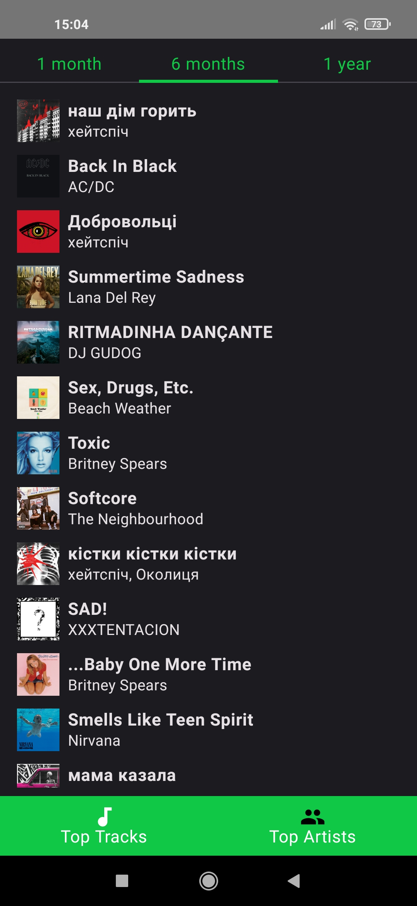
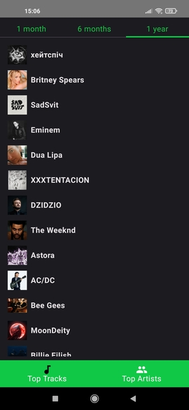

# Spofidata

Spofidata is an Android app that displays data about your top tracks and artists on Spotify, providing insights over various time ranges (monthly, half-yearly, or yearly). The app allows users to easily interact with their favorite music data and directly access Spotify to play tracks or view artist profiles.

## Technologies
* Kotlin
* Jetpack Compose
* Jetpack Navigation
* Hilt
* Retrofit
* Coil
* Spotify SDK
* Coroutines
* View Model

## Functionality

1. **Top Tracks:**
   Displays the user's top tracks over a selected time range (monthly, half-yearly, yearly). If the user clicks on a track, it will open Spotify and start playing the selected song.
   
   

2. **Top Artists:**
   Displays the user’s top artists over a selected time range (monthly, half-yearly, yearly), with the ability to click on any artist to open their Spotify profile page for further exploration.
   
   